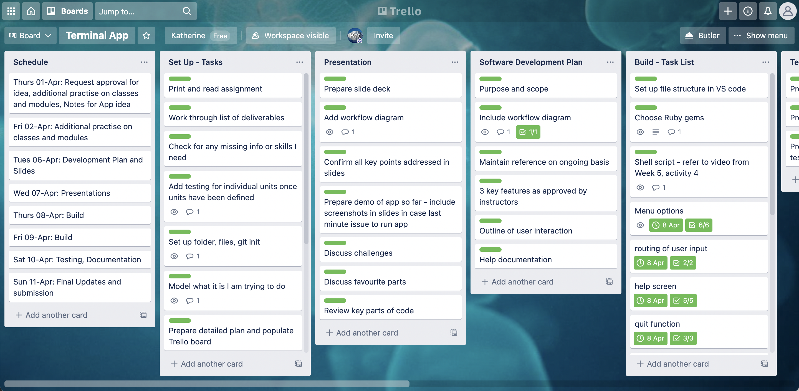

# Software Development Plan – ‘Things To Do’ App #

## Source Control Repository ##

https://github.com/katherine-rock/T1A3_terminal_app

## Purpose and Scope ##

The purpose of the ‘Things To Do’ app is to enable the user to use the terminal to maintain a list of open action items. Each action item can be further classified based on its user-defined category and priority level. 
Each action item and its corresponding category or priority level can be edited as required. Each action item can be deleted as it is completed or if it is no longer relevant. The list of action items is saved for future reference and updates. 

The complete list of action items can be displayed to the user in a table format. The user can also display a table of action items from a specific category. 

The app could be used for a variety of purposes, such as managing school assignments or personal goals. The fields of ‘category’ and ‘priority’ are optional, which makes the app quick to complete and therefore also suitable as a simple list tool. 

### Target Audience ###

The app allows users to record action items and sort these based on categories and priority levels of their own choosing. The app has a high degree of flexibility. Therefore, the target audience will be broad.  The app would be most suitable for students and professionals and others who have readily available access to a computer to run the terminal app. Although the terminal app has formatting for clarity of display and emphasis of key messages, it does not have a graphical user interface. Therefore, the app is most suited to users who are comfortable using the command line. 

### User Interaction ###

On opening the application in terminal, users are greeted with a main menu that includes the following options:
* Show all action items
* Add a new action item
* Edit an action item
* Choose a category to display
* Delete an action item
* Help
* Quit

Users then choose a command using the keyboard. 

__Show__ displays a table of all current action items including their automatically generated ID number

__Add__ asks the user to enter the 1. Action Item, 2. Category, 3. Priority

__Edit__ requests an ID number from the user and gives the user the option to update all fields of an action item (except the ID)

__Choose__ asks the user to enter their choice of category and then displays a table of action items only from that category

__Delete__ requests an ID number from the user and deletes the corresponding action item

__Help__ displays a detailed explanation of each main menu option and includes links to this README document and to the issues section of the GitHub repository

__Quit__ saves the users data and exists the program

After the user has completed each of the main functions (except quit) they are returned to the main menu to make their next selection. 

## Features ##

The ‘Things To Do’ app includes the following features:
1.	The ability to add, edit and delete action items from a list of action items
2.	The ability to display all action items or to choose a selection of items for display based on the item’s category
3.	Persistent storage so the list of action items can be saved and retrieved

__The ability to add, edit and delete action items from the list__


The ‘Things To Do’ app will provide the user the ability to add new action items to the app by using the keyboard to input the action item along with an optional category (such as work or personal) and an optional action item priority (such as ‘high’ or ‘low’). Once each action item is added, it is assigned a unique ID. The user can then use the unique ID to access and update the item or to delete the item from the list. This format is based on the create, read, update, delete (or CRUD) structure. 

__The ability to display all action items or to choose a selection of items for display based on the item’s category__


The app will provide the user the option to display all current action items (i.e. all items created and not deleted) to the terminal screen. The app will also provide the user the option to display only action items from within a category selected by the user. When the user enters a new action item, they can also enter an optional category. As part of the display function, the app will include the option to display only the items from within an individual category, or to display items that do not have a category assigned.  

__Persistent storage so the list of action items can be saved and retrieved__


The app has been set up with persistent storage so that each individual user can retrieve, display and update any previously entered action items. All current active data is saved to a YAML file when the user quits the program and ends the app session. If there is any stored data for an individual user, this is loaded when the user opens the app and is immediately available to read, edit/add or delete. Data is stored locally in a YAML file.

## User Interaction and Experience ##

__How the user will find out how to interact with / use each feature__

The ‘Things To Do’ app includes a main menu of options which is a central component of the user’s interaction with the app. The main menu is displayed each time the app is opened. It is also displayed after the user performs any function within the app, other than exiting the app. The main menu displays all the available options in a list format. Bold font has been used to show the user which words should be entered to access each function. 
 


The main menu also includes an option to access the in-app help screen. This screen includes further details on the input required from the user. This information has been colour-coded for emphasis. The in-app help screen also includes a link to this README document for further details and a link to the GitHub issues page for this app so users can report issues or ask questions. 
 


Individual functions within the app provide further instructions in the terminal to notify the user of the input required. 
* The ‘add’ function is separated into 3 questions to ask the user to input the action item, category and priority in turn to make the interaction as simple as possible. 
* The ‘choose category’ function instructs the user to enter the category name or to press enter to show all items without a specified category.
* The ‘edit’ and ‘delete’ functions follow the same pattern of asking the user to enter the ID number of the action item to be edited or deleted. This is to  ensure consistency and avoid confusion.  

__How the user will interact with / use each feature__

Almost all user interaction with the app is through the keyboard. The keyboard is used to choose options from the main menu and then to use each function. After each function is completed, the terminal displays a confirmation message to the user to confirm the function has been completed. The app routes the user to the main menu screen after each function is completed. 

The only user interaction that can be performed without the keyboard is to click on the links in the help screen to access this README document on GitHub or to report an issue via the app’s GitHub repository. The full URL is also displayed in the terminal. 

__How errors will be handled by the application and displayed to the user__

The app includes regular expressions to collect user input for the main menu options. The user only needs to enter the first letter correctly in order to select the corresponding function. For example, if the user enters ‘a’ instead of ‘add’, or if the user enters ‘addf’, the add function will be selected. The menu contains only one function that can be accessed with each letter/word to reduce the risk of the user accidentally selecting a different function to their intended choice. The aim of this approach is to minimise the possibility of errors and reduce user frustration. 

If the user enters an invalid input that does not correspond to any of the functions, an error message is displayed to the terminal in red text for emphasis. The error message informs the user the input is invalid and prompts the user to try again. The list of main menu options is repeated. Detailed instructions on how to select each function are included in the in-app help file. 

If the user attempts to ‘edit’ or ‘delete’ an action item that does not exist, i.e. if the ID number is not found, an error message is printed to the terminal informing the user that an action item with that ID number does not exist. The user is then re-directed to the main menu. This gives the user the option to either select the delete function again and enter a different ID number, or to select the ‘show all’ function, or ‘choose category’ function to confirm the ID number and then return to the delete function. 

If there are no current action items and the user requests to ‘show all’ items, ‘choose a category’ or ‘delete’ an action item, an error message is displayed to the terminal to inform the user there are no current action items. The user is then returned to the main menu. 

The ‘add’ function does not include any error messages as the format and type of acceptable input for these fields is at the user’s discretion. 

If the user enters a category that does not exist (including blank categories) when selecting a category to display, an error message is printed to the terminal and the user is returned to the main menu. 

If selection of any of the main menu functions does not work for any reason, an error message is displayed to the user along with a link to report the issue via the app’s GitHub page. The user is then returned to the main menu to make another selection. 

## Control Flow Diagram ##

The following diagram outlines the control flow of the ‘Things To Do’ app. 


## Implementation Plan ##

Design and implementation of the ‘Things To Do’ app was managed through Trello. The the live Trello board is available at:

https://trello.com/b/Dbg1mpLT/terminal-app  

Screenshots from initial Trello board at project initiation. 


Screenshots from latest Trello board at time of assignment submission. 



## Help and Installation Instructions ##

### 1. Install Ruby ###
To run the ‘Things To Do’ you need to have Ruby installed. 
To check if you have Ruby, go to your terminal and type:
``` ruby -v ```

If you already have Ruby installed, you will get a message to tell you which version you have. 
If you do not have Ruby installed, please visit the following link to install it:

https://www.ruby-lang.org/en/documentation/installation/ 

### 2. Download the app ###
After you have installed Ruby, please download the app files by visiting the following page:
https://github.com/katherine-rock/T1A3_terminal_app

Click on the green box labelled __Code__ to download the files for the app as a zip folder. 


### 3. Navigate to the folder ###
In the terminal navigate into the folder you just downloaded:

T1A3_terminal_app-main

### 4. Install the Ruby gems ###

In your terminal, enter the following command:

``` gem install bundler ```

This may take a minute or two. 

Then enter the following command to install the required Ruby gems:

```bundle install```

This may take a minute or two. 

### 5. Run the app ###

In your terminal, type the following:

```./run_todolist.sh```

If you find the terminal opens a new window and then immediately closes it, or it opens to a blank screen and nothing happens, it may be that your terminal is set up to run Ruby files automatically. If this is the case, please try the following command in your terminal:

```ruby todolist.rb```

### How to Use the App ###
Please refer to the section User Interaction above for an explanation of how to use the app. This information is also available from the in-app help screen which can be accessed from the main menu by entering ‘h’ or ‘help’.

### Dependencies ###
The following Ruby gems are required to run the ‘Things To Do’ app:
* Colorize gem
* Link Gem 
* Pastel gem
* TTY Table

All these gems should be downloaded and installed automatically when you follow the installation instructions above. If there are any issues, you can access further instructions to install each gem individually by following the links in the References section below. 

### System Requirements ###
The app requires Ruby to run. Please refer to step 1 of the installation instructions above. 

### Report an Issue ###
To log an issue with the ‘Things To Do’ app, please visit:

https://github.com/katherine-rock/T1A3_terminal_app/issues 


## References ##

Kalbarczyk, M., 2016. Ruby gem: colorize, v0.8.1. [Online] 
Available at: https://rubygems.org/gems/colorize/versions/0.8.1 
[Accessed 06 Apr 2021].

Murach, P., 2020. GitHub: pastel (Ruby Gem). [Online] 
Available at: https://github.com/piotrmurach/pastel
[Accessed 10 Apr 2021].

Murach, P., 2021. GitHub: tty-link (Ruby Gem). [Online] 
Available at: https://github.com/piotrmurach/tty-link
[Accessed 10 Apr 2021].

Murach, P., 2021. GitHub: tty-table (Ruby Gem). [Online] 
Available at: https://github.com/piotrmurach/tty-table
[Accessed 06 Apr 2021].